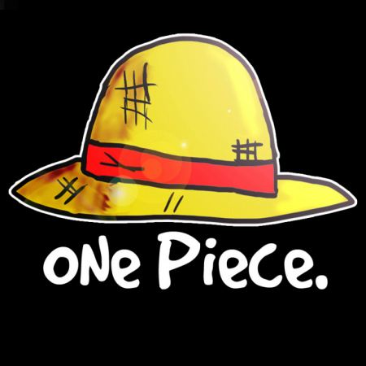
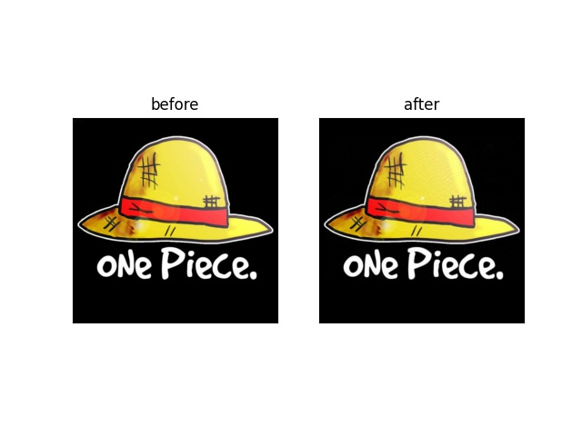

## 主成分分析法（Principal Component Analysis，PCA）

### 一、主成分分析法简介

在实际课题中，为了全面分析问题，往往提出很多与此有关的变量(或因素)，因为每个变量都在不同程度上反映这个课题的某些信息。主成分分析法就是将多个变量通过线性变换以选出较少个数重要变量的一种多元统计分析方法，是最常用的一种数据降维算法，在得到的新的几个少数变量中依据主成分所含信息量的大小成为第一主成分，第二主成分等等。

在数学上，主成分分析的过程实际就是用一个低维平面拟合高维空间中的样本点，其中高维空间的各个坐标就是原始变量，低维平面的各个坐标就是新的较少个数重要变量。由于样本点的方差越大，说明数据分布越散，所取值的可能性越多，所包含的信息量也就越大；那么样本点在某个坐标方向上的方差越大，其对应变量的信息量就越大，所以在低维平面上方差最大坐标方向所对应的变量就是第一主成分，以此类推。

得到的主成分与原始变量之间的关系：

- 主成分保留了原始变量绝大多数信息。
- 主成分的个数大大少于原始变量的数目。
- 各个主成分之间互不相关。
- 每个主成分都是原始变量的线性组合。

主成分分析法的理论解释有两种：

- 最大方差理论。
- 最小化降维损失。

这两种解释都能推导出相同的结果，这里只是使用 PCA 算法，其理论推导与具体实现此处不作介绍。

### 二、案例：图片压缩

下面使用 scikit-learn 库中的 PCA 工具来实现样本的降维，其参数、属性和示例在[官方网站文档][1]中有详细描述。以一张 450 x 450 像素大小 RGB 彩图图片作为降维示例，如下所示：



读取出来后的数据形状为 450 x 450 x 3 = 607500，其数据量达到了六十万，显然不是一个小数目，因此在处理前最好对其降维。但读取出的数据是三维的，因此需要转化为二维，如变成 450 x 1350 后，再对其进行 PCA 降维处理。

需要说明的是降维一张图片时，没有明确的特征定义，因此这里转化为二维的形式不是固定的，只要符合 n x m = 607500 且 n, m为正整数即可，此时相当于对一张图片进行压缩。如果是多张图片时，那么每张图片为一个样本，图片的每个像素都是一个特征，所以需要将一张图片转化为一行向量；多张图片则对应为一个矩阵，每一行代表一张图片样本，每一列代表图片的一个特征（像素），此时就是对所有图片样本进行特征降维。

使用 scikit-learn 库中的 PCA 工具在降维时，需要指定降维后所保留的主成分个数，保留的个数越多，越能够保留原始数据的信息。假设保留 10 个主要成分，且二维形状为 450 x 1350 ，那么降维后的数据形状为 450 x 10 = 4500 ，数据量瞬间就降低了两个数量级，并且可以查看降维后保留的信息量百分比。

假设 img 为读取出来的 450 x 450 x 3 的图片数据，那么以上过程的代码如下：

```python
# 将图片数据转化为二维
img = img.reshape(img.shape[0], -1)
print(img.shape)	# 结果为 450 x 1350

# 对转化后的数据进行 PCA 降维
pca = PCA(n_components=10).fit(img)
print("保留的信息量百分比：{} %".format(pca.explained_variance_ratio_.sum()*100))
img = pca.transform(img)
print(img.shape)	# 结果为 450 x 10
```

如果没有其他指定要求（比如需要更高的保留的信息量百分比），这里得到的降维结果就可以直接使用在其他地方了（比如作为压缩结果传输，或者多张图片时作为训练样本输入等），此时的 img 数据量已经小的多得多了。

如果是作为压缩结果（单张图片），自然是需要还原出原图的；作为降维结果（多张图片），同样可以还原出原图来看看降维后图片的保真度。使用 scikit-learn 库中的 PCA 工具将数据还原至降维前的高维原空间中只需一行代码，然后对还原结果结果稍作处理即可得到还原后的图片。这里以上面单张图片处理后的结果为例：

```python
# 将降维后的数据还原至原空间
img = pca.inverse_transform(img)

# 将还原的数据处理为 RGB 图片数据 0~255 的整数格式
img = img.reshape(450, 450, 3)
img = img.astype(int)
img = np.clip(img, 0, 255)
```

由以上代码得到的图片还原结果与原图的比较如下所示：


显然图片模糊了许多，说明只保留 10 个主成分的话丢失的信息过多，因此可以尝试保留更多的主成分。下面则是保留 100 个主成分的结果与原图比较：



可以看出两者几乎没有什么明显区别了，但后者的数据量 450 * 100 = 45000 却比原图的数据量小了一个数量级。

[1]: https://scikit-learn.org/stable/modules/generated/sklearn.decomposition.PCA.html?highlight=pca#sklearn.decomposition.PCA	"查看PCA官方文档"

